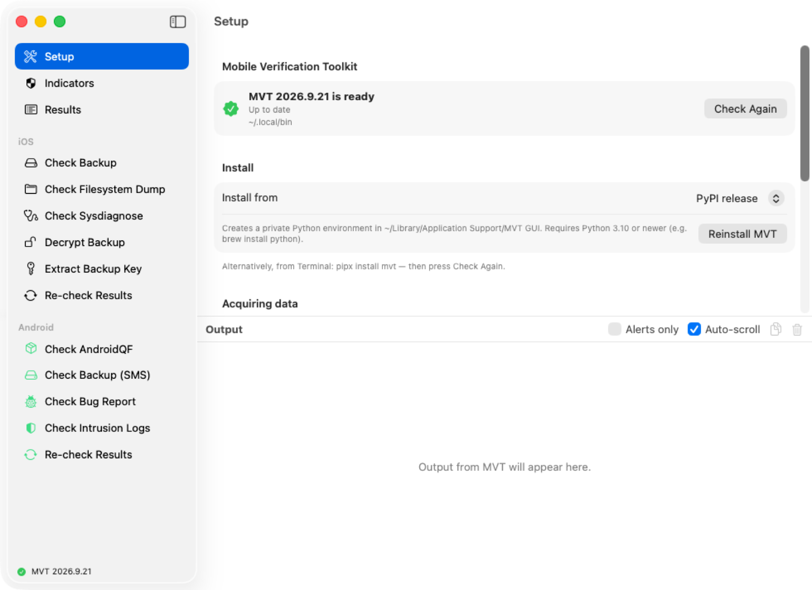
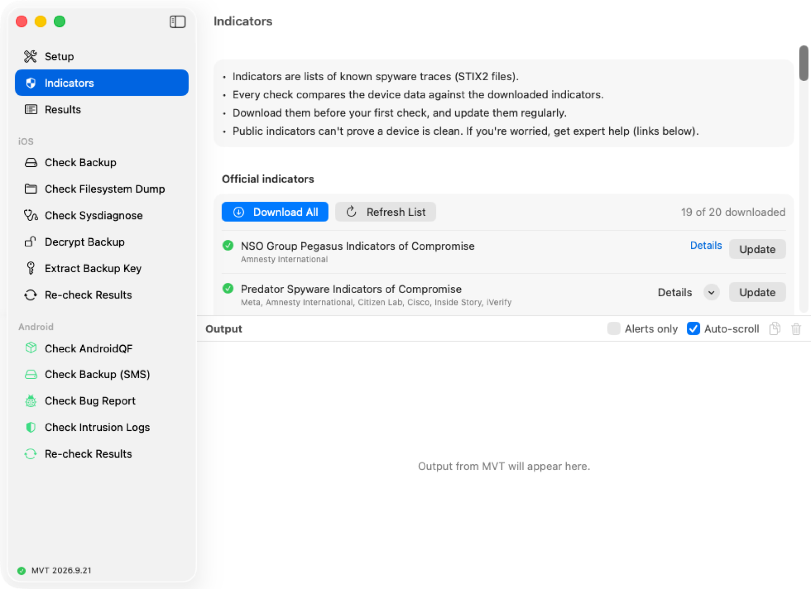

# MVT for Mac

Check iPhones and Android phones for traces of known spyware, without the
Terminal. **MVT for Mac** is a simple app for the
[Mobile Verification Toolkit (MVT)](https://docs.mvt.re/) by Amnesty
International's Security Lab.

## Get the app

1. Download the latest `MVT-GUI-…-macOS.zip` from
   [Releases](https://github.com/2B-4G10/MVT-GUI/releases).
2. Unzip it and move **MVTGUI.app** to your **Applications** folder.
3. The first time only: right-click the app, choose **Open**, then **Open**
   again. The app isn't notarized by Apple.

You need macOS 13 Ventura or newer, and Python 3.10 or newer
(`brew install python`).

## Set it up (once)

1. Open **Setup** and press **Install MVT**.
   - If MVT is already installed, the app finds it.
   - If your MVT is out of date, press **Update MVT**.
2. Open **Indicators** and press **Download All**.

Indicators are lists of known spyware traces. The app downloads them from
the official sources:
[mvt-indicators](https://github.com/mvt-project/mvt-indicators),
[Amnesty International](https://github.com/AmnestyTech/investigations) and
[Echap's stalkerware indicators](https://github.com/AssoEchap/stalkerware-indicators).
Download them again from time to time to stay current.

## Check an iPhone

1. Connect the iPhone and open it in **Finder**.
2. Tick **Encrypt local backup**, set a password and press **Back Up Now**.
3. In the app, open **Decrypt Backup**:
   - **Backup folder:** the backup in
     `~/Library/Application Support/MobileSync/Backup/`
   - **Destination folder:** any empty folder
   - **Backup password:** the one from step 2
4. Press **Decrypt**, then **Check Decrypted Backup**.
5. Choose a **Results folder** and press **Run Check**.

## Check an Android phone

1. Collect the phone's data with
   [AndroidQF](https://github.com/mvt-project/androidqf).
2. In the app, open **Check AndroidQF** and choose AndroidQF's output
   folder.
3. Choose a **Results folder** and press **Run Check**.

## Read the results

1. Press **View Results** when the check finishes, or open **Results** and
   choose the results folder.
2. Alerts are sorted by severity: **Critical**, **High**, **Medium**,
   **Low**, **Info**.
3. Click an alert to see what triggered it.

> **No alerts doesn't mean a phone is clean.** Public indicators miss new
> and targeted attacks. If you're worried, get expert help from
> [Amnesty International's Security Lab](https://securitylab.amnesty.org/get-help/?c=mvt_docs)
> or [Access Now's Digital Security Helpline](https://www.accessnow.org/help/).

## Tips

- **Choose Indicators…** in any check lets you use all indicators, only the
  ones you pick, or your own STIX2 files.
- **Re-check Results** compares old results against newer indicators,
  without the phone.
- Passwords go to MVT privately and never appear on the command line.

## Use it responsibly

Only check phones whose owners have agreed. This is a condition of the
[MVT license](https://docs.mvt.re/en/latest/license/) that this project
uses (see [LICENSE](LICENSE)).

## For developers

- **Code:** the app is in [`macos/`](macos/README.md). MVT itself is in
  `src/`, kept in sync with
  [mvt-project/mvt](https://github.com/mvt-project/mvt) every day.
- **Build:** open `macos/MVTGUI.xcodeproj` in Xcode 15 or newer and press ⌘R.
- **Release:** run **Actions → Release macOS app** with a version such as
  `2.0.0-beta`.
- **MVT on the command line:** see the [MVT documentation](https://docs.mvt.re/).
