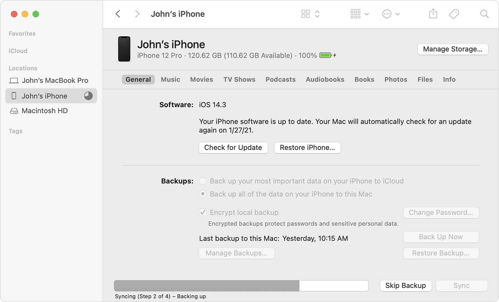
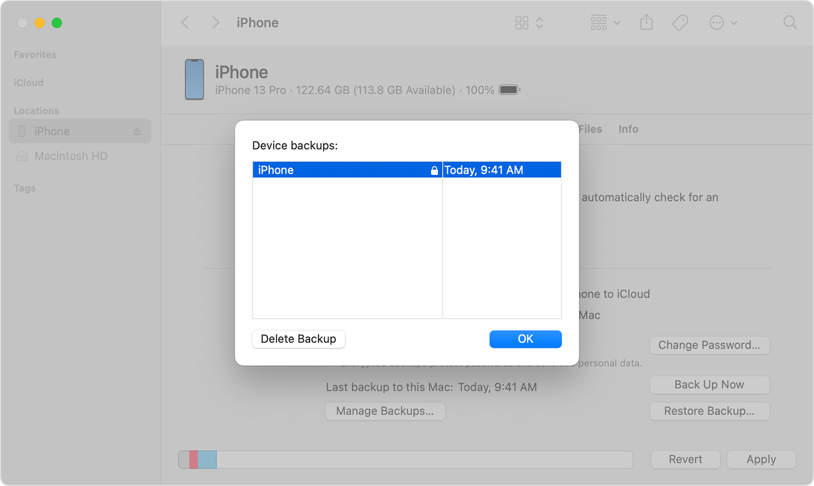

# Backup with iTunes app

It is possible to do an iPhone backup by using iTunes on Windows or macOS computers (in most recent versions of macOS, this feature is included in Finder, see below).

To do that:

1. Make sure iTunes is installed.
2. Connect your iPhone to your computer using a Lightning/USB cable.
3. Open the device in iTunes (or Finder on macOS).
4. If you want to have a more accurate detection, ensure that the encrypted backup option is activated and choose a secure password for the backup.
5. Start the backup and wait for it to finish (this may take up to 30 minutes).

_Source: [Apple Support](https://support.apple.com/en-us/HT211229)_

Once the backup is done, find its location and copy it to a place where it can be analyzed by MVT. On Windows, the backup can be stored either in `%USERPROFILE%\Apple\MobileSync\` or `%USERPROFILE%\AppData\Roaming\Apple Computer\MobileSync\`. On macOS, the backup is stored in `~/Library/Application Support/MobileSync/`.

# Backup with Finder

On more recent MacOS versions, this feature is included in Finder. To do a backup:

1. Launch Finder on your Mac.
2. Connect your iPhone to your Mac using a Lightning/USB cable.
3. Select your device from the list of devices located at the bottom of the left side bar labeled "locations".
4. In the General tab, select `Back up all the data on your iPhone to this Mac` from the options under the Backups section.
5. Check the box that says `Encrypt local backup`. If it is your first time selecting this option, you may need to enter a password to encrypt the backup.

_Source: [Apple Support](https://support.apple.com/en-us/HT211229)_

6. Click `Back Up Now` to start the back-up process.
7. The encrypted backup for your iPhone should now start. Once the process finishes, you can check the backup by opening `Finder`, clicking on the `General` tab, then click on `Manage Backups`. Now you should see a list of your backups like the image below:

_Source: [Apple Support](https://support.apple.com/en-us/HT211229)_

If your backup has a lock next to it like in the image above, then the backup is encrypted. You should also see the date and time when the encrypted backup was created. The backup files are stored in `~/Library/Application Support/MobileSync/`.

## Notes:

- Remember to keep the backup encryption password that you created safe, since without it you will not be able to access/modify/decrypt the backup file.
